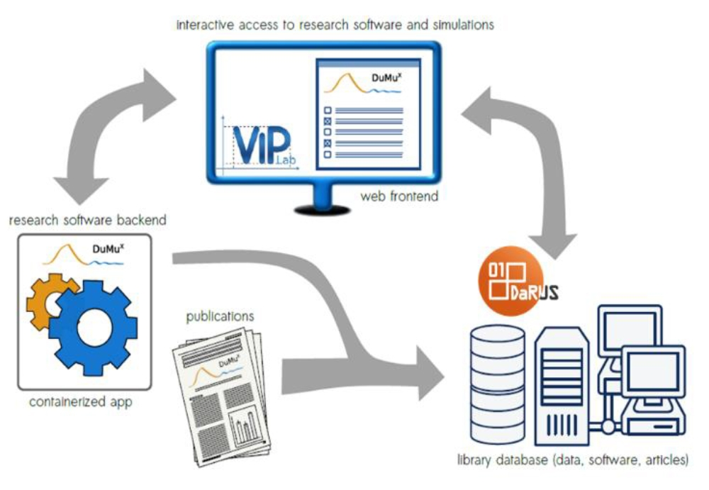

# Overview over SusI Project

<figure markdown>
  |{: style="max-width: 100%"}|
  |:---:|
  |<figcaption>SusI Overview</figcaption>|
</figure>

## Components

### DuMux

TODO: Short intro...

More information can be found using this Link: [DuMux](https://dumux.org/)

### DaRUS

TODO: Short intro...

More information can be found using this Link: [DaRUS](https://www.izus.uni-stuttgart.de/fokus/darus)

### ViPLab

TODO: Short intro...

More information can be found using this Link: [ViPLab](https://virtualprogramminglab.github.io/documentation/)

## How to set up the Project yourself

### TODO: Requirements

How can I use it myself? Boundary conditions/ What is needed for usage (requirements)?

### TODO: Instructions

## TODO: Im DaRUS-Kontext:

- Interoperability: MetadataMapper and
- Archiving: Linkage to Software Heritage was propelled
